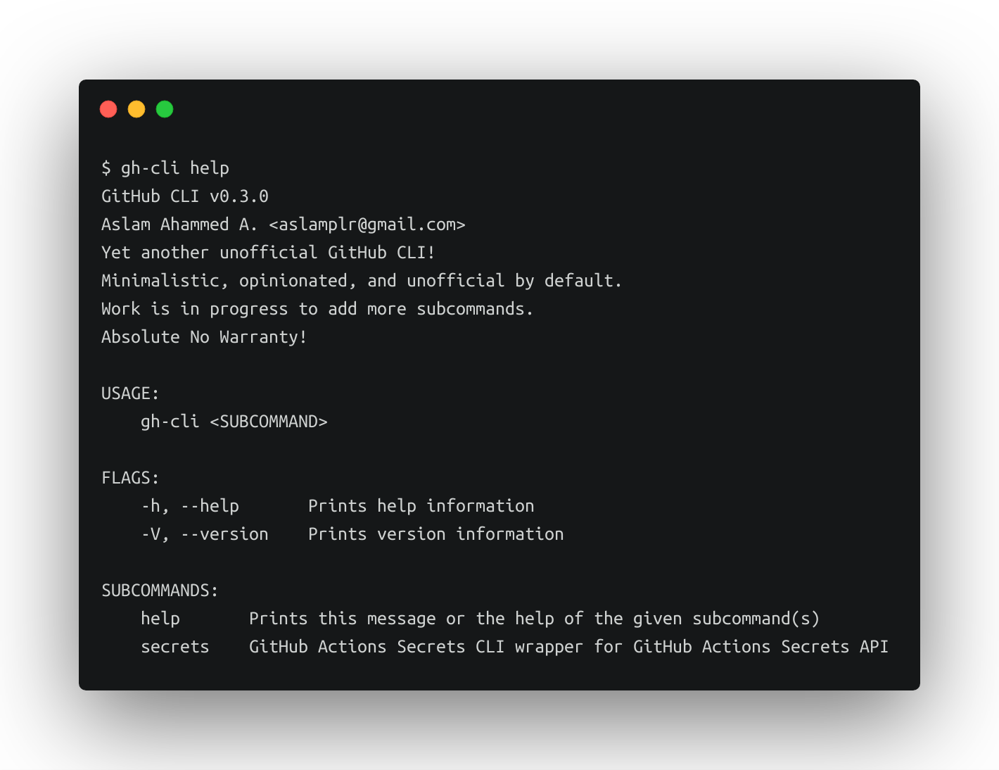
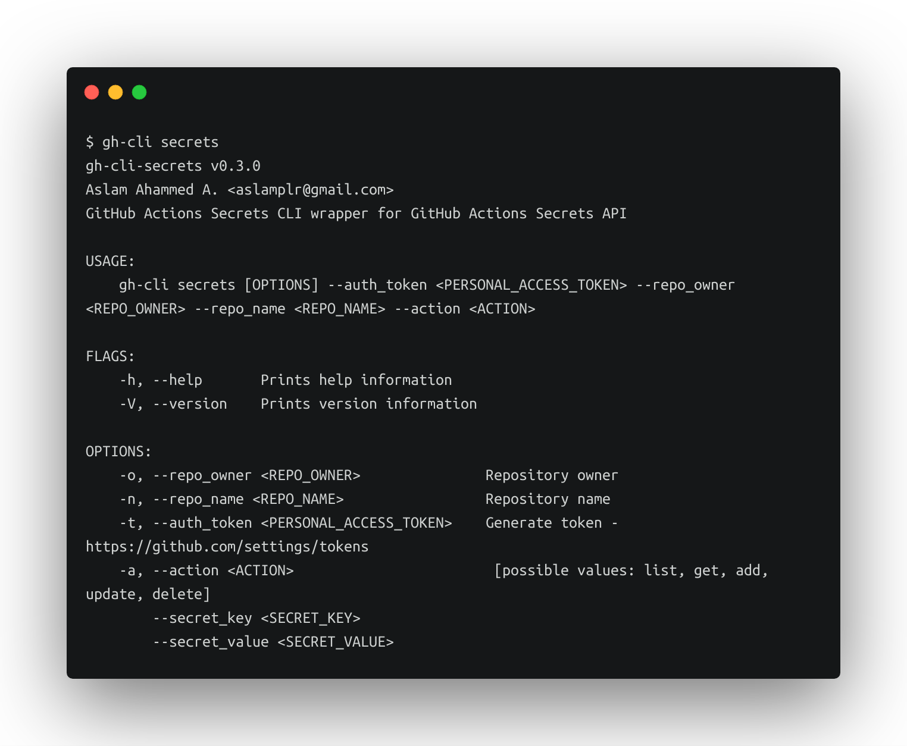

# gh-cli 
named `gh-actions-secrets` earlier, renamed to `gh-cli`.

[🗃 » Download the latest release «](https://github.com/aslamplr/gh-cli/releases)



## Sub Commands

### Secrets


#### Example

**Add new secret to Github actions secrets**

```
gh-cli secrets --auth_token=qwertyuipasdfghjklzxcvbnmlkgsdfg --repo_owner aslamplr --repo_name gh-actions-secrets --action add --secret_key SECRET_KEY --secret_value SECRET_VALUE_XYZ_BLAH_BLAH
```

**List all secrets**

```
gh-cli secrets --auth_token=qwertyuipasdfghjklzxcvbnmlkgsdfg --repo_owner aslamplr --repo_name gh-actions-secrets --action list
```

## Development
### Requirements

- Rust (rustc 1.43.0)

### Run 

```
cargo run -- --help
```

### Build (release)

```
cargo build --release
```

## Roadmap
- Blazing fast Unofficial Github CLI implemented in Rust 
- Rust client library for Github API
