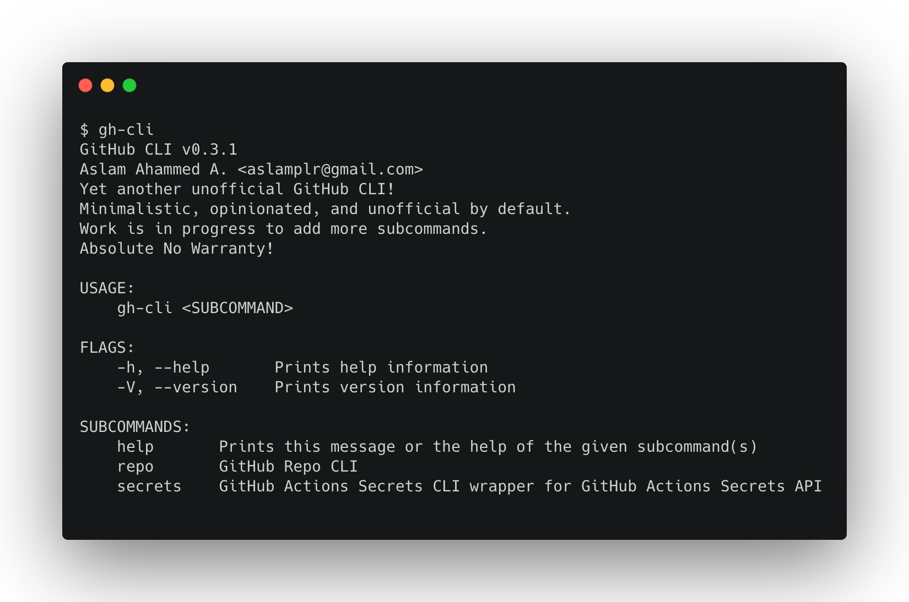
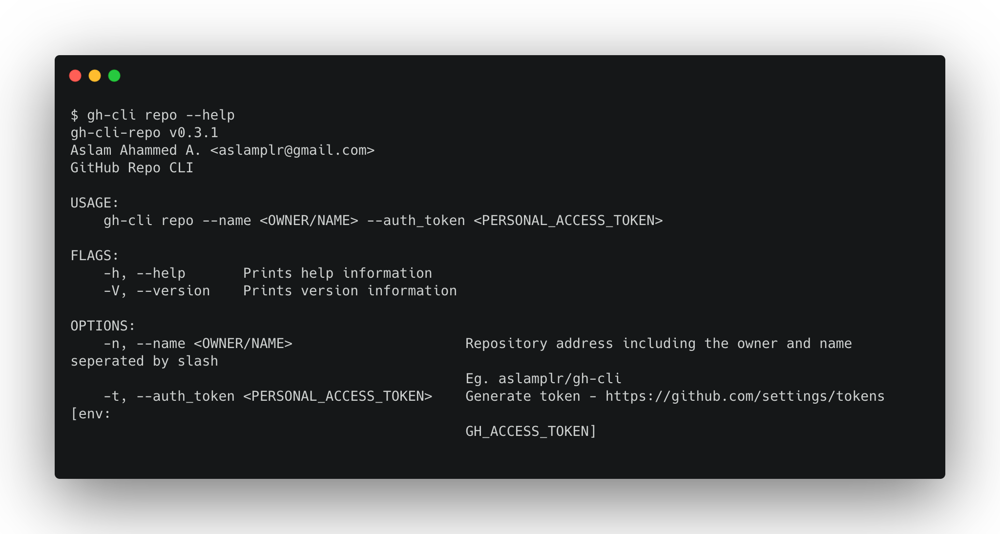
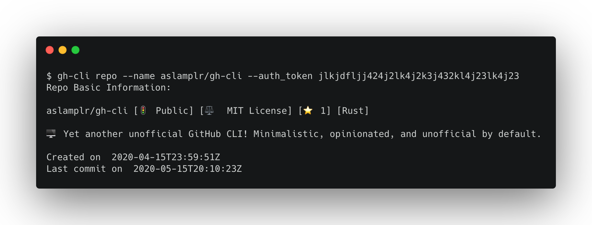
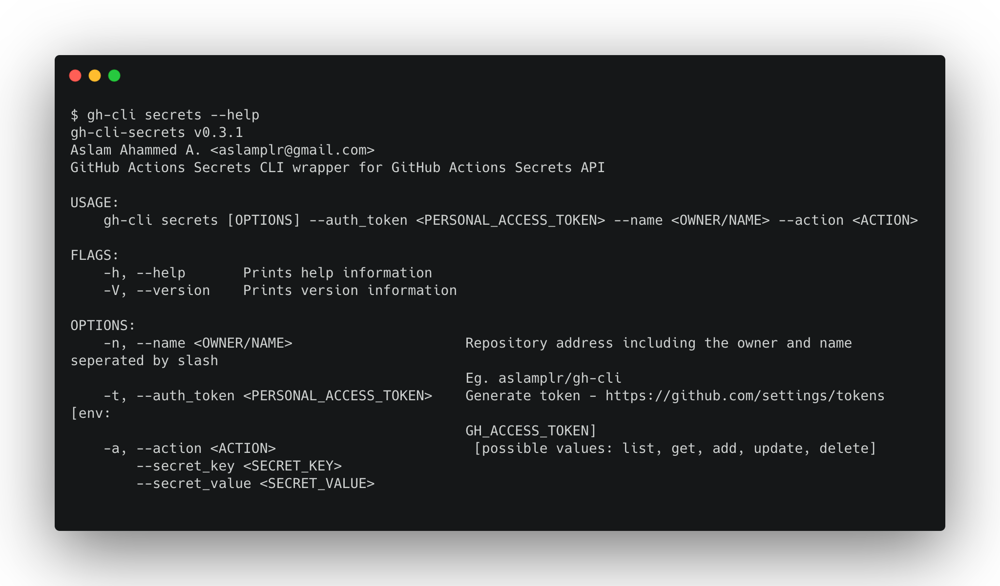
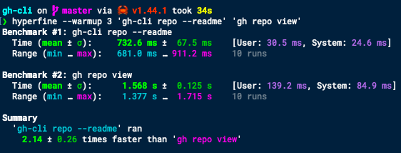

# gh-cli 
named `gh-actions-secrets` earlier, renamed to `gh-cli`.

## Install

### Option 1
Download pre-compiled binaries for MacOS, Ubuntu and Windows from the release page.  

[🗃 » Download the latest release «](https://github.com/aslamplr/gh-cli/releases)

### Option 2
If you have installed `cargo` you may proceed to install this CLI using cargo. Note that while installing with cargo, cargo will try to build this crate from source. 

```
cargo install --git https://github.com/aslamplr/gh-cli.git --tag v0.3.1
```

You may install `cargo` along with `rust`, follow the [rust install instructions from here](https://www.rust-lang.org/tools/install)




## Sub Commands

### Repo


#### Example


### Secrets


#### Example

**Add new secret to Github actions secrets**

```
gh-cli secrets --auth_token=qwertyuipasdfghjklzxcvbnmlkgsdfg --name aslamplr/gh-cli --action add --secret_key SECRET_KEY --secret_value SECRET_VALUE_XYZ_BLAH_BLAH
```

**List all secrets**

```
gh-cli secrets --auth_token=qwertyuipasdfghjklzxcvbnmlkgsdfg --name aslamplr/gh-cli --action list
```

## Development
### Requirements

- Rust (rustc 1.43.0)

### Run 

```
cargo run -- --help
```

### Build (release)

```
cargo build --release
```

## Roadmap
- Blazing fast Unofficial Github CLI implemented in Rust 
- Rust client library for Github API

## Benchmark comparison using hyperfine on MacBook Air

command: `hyperfine --warmup 3 'gh-cli repo --readme' 'gh repo view'`



_Note: Both `gh-cli` and `gh` pre logged in to make sure both have proper access tokens prior to run benchmarks._
